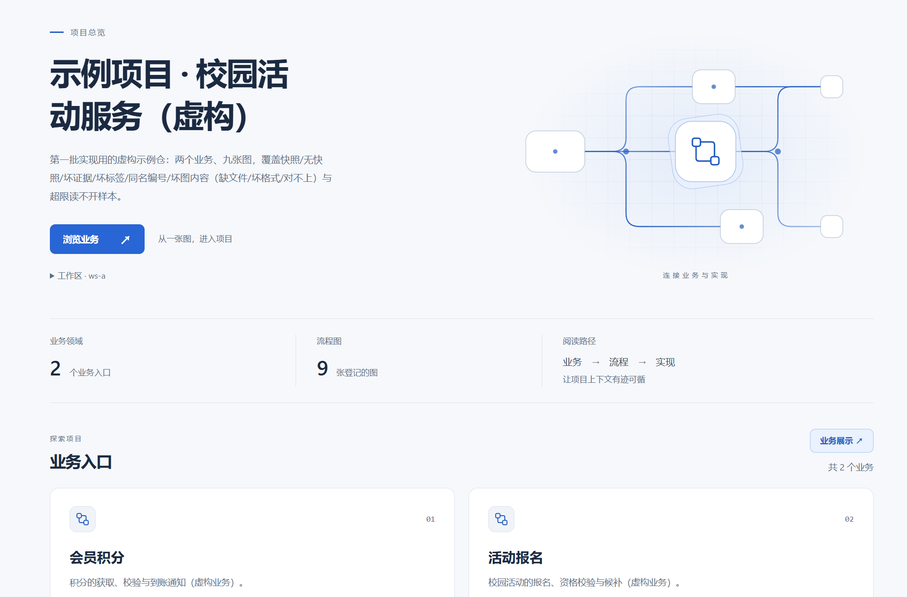
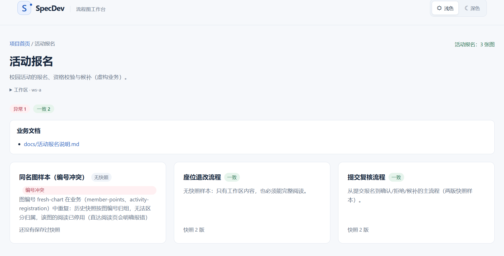
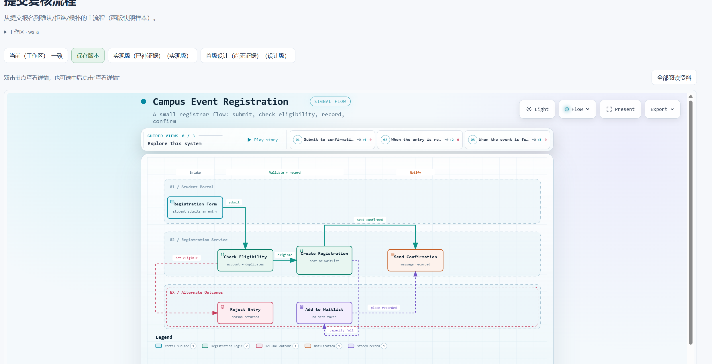
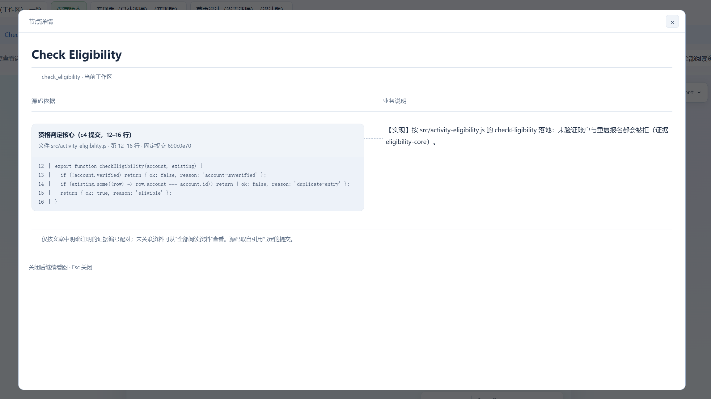

# SpecDev · DSH 流程图工作台

简体中文 ｜ [English](README.md)

## 下载与安装

前置：已安装 DSH（DeepSeek Harness），终端可用 `dsh`、`pnpm` 和 `git`。复制执行这一条命令，直接从 GitHub Release 下载并安装 **0.1.11**：

```sh
dsh plugin --profile web add https://github.com/pioneer666-user/dsh-archify-manage/releases/download/v0.1.11/specdev-dsh-archify-manage-0.1.11.tgz
```

安装完成后重启 DSH，在侧栏点击 **「流程图管理」→ 选择工作区**，即可在新标签打开项目。无需手填项目路径，沿用 DSH 的登录会话。

[下载 0.1.11 安装包](https://github.com/pioneer666-user/dsh-archify-manage/releases/download/v0.1.11/specdev-dsh-archify-manage-0.1.11.tgz) · [查看 Releases](https://github.com/pioneer666-user/dsh-archify-manage/releases)

> 命令对应 `v0.1.11` Release 中的同名安装包，需该附件发布后可用。已验证的宿主环境为 **Windows · DSH 0.1.6-alpha.2 · web profile**。

<details>
<summary>已经装过旧版？升级到 0.1.11</summary>

关闭正在运行的 DSH，依次执行，再重新启动：

```sh
dsh plugin --profile web remove @specdev/dsh-archify-manage
dsh plugin --profile web add https://github.com/pioneer666-user/dsh-archify-manage/releases/download/v0.1.11/specdev-dsh-archify-manage-0.1.11.tgz
```

使用先移除、再安装的方式确保替换旧文件。项目中的图文件与 Git 快照保留在业务仓库里。

</details>

## 从一张图，进入项目

接手一个项目时，我们通常想先弄清楚：它有哪些业务，一条流程怎么走，某一步为什么这样处理，以及实现到底在哪里。

**SpecDev 把业务目录、交互式流程图、节点说明和源码证据放到同一条阅读路径里：**

**项目 → 业务 → 流程 → 节点 → 源码**

它是一个 DSH 插件（包名 `@specdev/dsh-archify-manage`），使用 Archify 渲染 workflow 图。你可以先了解全貌，再沿着感兴趣的节点看说明和实现；也可以切回保存过的设计版或实现版，回看当时的图与依据。

这个插件来自对 AI 辅助开发流程的探索：让需求讨论、实现和核对拥有一个方便打开、能追溯出处的阅读入口。本仓库是整理后开源的插件源码。

## 界面预览

以下截图来自虚构的校园活动示例项目。示例特意包含异常数据，用来展示编号冲突、缺少资料等情况的提示。

### 项目首页：先看全貌，再进入业务

项目介绍、业务数量与流程图数量集中呈现；从业务入口继续浏览。管理页面支持浅色与深色主题，并记住你的选择。



### 业务页：把说明、图和状态放在一起

业务介绍、文档入口与流程图列表按业务归组。每张图都能看到快照数量与当前状态，异常会直接标出。



### 看图：沿着流程阅读，随时切换版本

交互式流程图与版本条放在同一页。可以查看当前工作区，也可以阅读保存过的设计版或实现版。



### 节点详情：左边源码，右边说明

**双击节点**即可打开详情，也可以选中节点后点击图外的 **「查看详情」**。源码与文案逐组对齐；关闭详情后，继续看原来的图。完整文档和未关联引用收在 **「全部阅读资料」** 中。



## 还能做什么

| 能力 | 使用方式 |
|---|---|
| 多工作区入口 | 从 DSH 侧栏选择工作区，各页面始终绑定所选项目 |
| 业务展示 | 首页进入「业务展示」，可在列表、星图、球阵三种格式间切换 |
| 历史版本 | 按版本条切换，读取该版的流程图、节点说明与证据清单 |
| 保存版本 | 为已提交的图内容登记名称、阶段和说明，便于之后回看 |
| 随包 AI 技能 | `archify-maker` 提供设计、实现、证据核对与后续修改指引，插件加载时自动注册到 DSH |

**管理页面唯一的写操作是「保存版本」：给 Git 提交添加附注标签，不改动业务项目的文件、分支或提交。** 随包技能用于指导 AI 制作或修改项目文件，由你授权其工作范围。

## 第一次使用

1. **选好项目。** 在 DSH 中添加或选择业务仓库工作区；工作区目录应为 Git 仓库顶层。
2. **准备图。** 已有 `docs/archify/` 数据的项目可以直接浏览；没有数据时，可让 DSH 中的 AI 使用随包技能 `archify-maker`，根据你的业务需求制作图与说明。
3. **打开阅读。** 侧栏「流程图管理」→ 工作区 → 业务 → 图。双击节点，看源码与说明的对应关系。
4. **保留一个版本。** 确认内容并提交 Git 后，在图的「当前（工作区）」视图点击「保存版本」。之后可在版本条中切换阅读。

“零配置”指无需手动配置插件的项目路径；插件读取项目中已有的图文件，安装本身不会自动把任意代码仓库转换成流程图。

<details>
<summary>还没有图：可以怎样向 AI 提出需求？</summary>

在目标项目的 DSH 会话里说明要处理哪一项业务，例如：

> 请使用 archify-maker，为当前项目的活动报名业务制作业务说明、workflow 图和节点详情，并按 docs/archify 的目录约定登记。先与我确认业务规则；尚未实现的部分标成设计，源码证据没有核实就留空。

技能按阶段组织工作，区分设计、实现事实与未核实内容；图仍需由你查看和验收。技能说明见 [archify-maker](skills/archify-maker/SKILL.md)。

如果只想查看虚构示例，克隆本仓库后可在仓库根目录运行（需要 Node.js 与 Git，目标目录必须不存在）：

```sh
node sample/generate.mjs ./local-artifacts/demo-project
```

再把生成的 `local-artifacts/demo-project` 作为 DSH 工作区打开。示例包含正常与异常样本，说明见 [示例项目](sample/README.md)。

</details>

## 使用说明

<details>
<summary>图与说明存在哪里？</summary>

所有阅读数据都在你的业务仓库中：

```text
docs/archify/
  project.json                         # 项目名与介绍
  <业务id>/business.json               # 业务介绍与文档入口
  <业务id>/<图id>/chart.json           # 图名称与摘要
  <业务id>/<图id>/workflow.json        # Archify workflow 图源
  <业务id>/<图id>/details.md           # 按节点分节的说明
  <业务id>/<图id>/evidence.json        # 固定提交的源码引用
```

业务 ID、图 ID 与目录名一致；图 ID 在整个项目中必须唯一。没有节点说明或源码证据也可以看图，缺失或无效的资料会明确提示。

详细字段与示例见 [文件组织约定](skills/archify-maker/references/project-contract.md)。

</details>

<details>
<summary>怎样让节点说明与源码对应？</summary>

在 `details.md` 中用二级标题写节点 ID，在正文中明确标注证据编号。例如：

```markdown
## check_eligibility
### 检查报名资格
【实现】未验证账户与重复报名都会被拒绝。（证据 eligibility-core）
```

`eligibility-core` 精确对应同一版本 `evidence.json` 中的 `refs[].id`。每条源码引用记录仓库内文件路径、40 位完整提交号和起止行号，阅读时取该提交里的代码。

- 三级标题用于分组；未用三级标题时按段落分组，顺序跟随文案。
- 一组可以引用多个证据编号，用顿号分隔；代码围栏内的示例不参与配对。
- 未声明关联的段落不会猜测源码；缺失、重复或无效的引用会说明原因。
- 详情不是完整 Markdown 渲染器；支持常用的标题、段落、列表、加粗与代码展示。

节点详情展示的是**已声明的对应关系**；有源码出处，不代表业务规则已经被证明正确。

</details>

<details>
<summary>保存版本会保存什么？</summary>

保存版本会创建 Git 附注标签 `archify/<图编号>/<版本标识>`。随版本读取的文件是 `workflow.json`、`details.md` 和 `evidence.json`；源码片段始终取自各条证据引用固定的提交。

保存前会检查这三个图文件是否与当前提交一致。相关文件尚未提交、页面内容过期或提交已变化时，会说明原因并阻止保存；同一份内容、同一阶段重复保存，会返回已有版本。

图名称与摘要、业务介绍、业务文档入口和业务文档内容仍读取当前工作区。核对历史业务文档时，需要按快照对应的提交另行查看 Git。

不合规的快照标签会计入无效标签并忽略。当前不提供删除版本、版本改名、跨仓库证据或推送远端功能。

</details>

<details>
<summary>打不开页面，或者需要手动指定仓库？</summary>

先通过 DSH 启动时给出的地址登录，再从侧栏进入。页面与 API 沿用 DSH 登录会话和来源校验；认证不可用时会拒绝访问。

工作区模式要求目录是 Git 仓库顶层；子目录、失效的工作区标识或不可用的工作区服务都会明确报错。

宿主没有工作区注册表，或需要固定指向一个仓库时，可在 web profile 的 `cordis.patch.yml` 中按 ID 覆盖配置：

```yaml
- id: specdev-archify-manage
  config:
    repoRoot: 'D:/你的/业务项目仓库'
```

不要使用 `- insert:`，它会新增重复条目。配置后重启，访问同一个 DSH 地址下的 `/archify-manage/`，不携带 `workspace` 参数；工作区清单不可用或为空时，侧栏也会显示「直接打开管理页」入口。配置优先级为：组合包 → profile → home → `--patch` overlay，后者覆盖前者。

如果手动下载 `.tgz` 安装，文件所在路径不能含空格（DSH 侧限制）；上面的 Release 地址安装方式无需处理本地路径。

</details>

## 开发参考

<details>
<summary>从源码构建</summary>

Node.js ≥ 22。在插件仓库根目录运行：

```sh
npm install
npm run typecheck
npm run build
npm pack --pack-destination .
```

产出 `specdev-dsh-archify-manage-0.1.11.tgz`。渲染器和校验工具已随源码提供，不需要另行克隆 Archify。

需要行为检查时，按需依次运行 `node scripts/smoke.mjs` 与 `node scripts/check-save.mjs`；它们创建临时示例仓，不操作你的业务项目。

</details>

<details>
<summary>页面与 API</summary>

以下路径都以 `/archify-manage` 为前缀。工作区模式自动携带 `?workspace=<id>`，页面与 API 均要求已登录 DSH。

| 路径 | 用途 |
|---|---|
| `/` | 项目首页 |
| `/showcase` | 项目级业务展示：列表、星图、球阵 |
| `/business/<业务id>` | 业务介绍、文档与图列表 |
| `/read/<业务id>/<图id>` | 图与节点详情；`v=current` 或标签名选择版本 |
| `GET /api/workspaces` | DSH 工作区清单 |
| `GET /api/inventory`、`/api/chart`、`/api/doc` | 目录、图与业务文档 |
| `GET /api/evidence` | 按引用读取源码，供脚本使用 |
| `POST /api/evidence` | 用页面已加载的证据清单读取源码，避免与图版本错配；不写仓库 |
| `GET /api/snapshots` | 保存前检查 |
| `POST /api/snapshots` | 保存版本；使用 `head` 与 `fingerprint` 校验提交和内容 |

</details>

已验证范围为 Windows 单机与 DSH 0.1.6-alpha.2 的 web profile。尚未完成其他机器、其他宿主版本，以及真实 DSH AI 会话中从技能触发到生成产物的完整端到端验收。

## 许可证与致谢

本项目采用 [MIT 许可证](LICENSE)。感谢 DSH 提供插件宿主，Archify 提供流程图渲染与校验能力。随包 Archify 副本同为 MIT，其 [许可证](vendor/archify-renderer/archify/LICENSE) 与 [第三方声明](vendor/archify-renderer/archify/THIRD_PARTY_NOTICES.md) 随源码保留。
